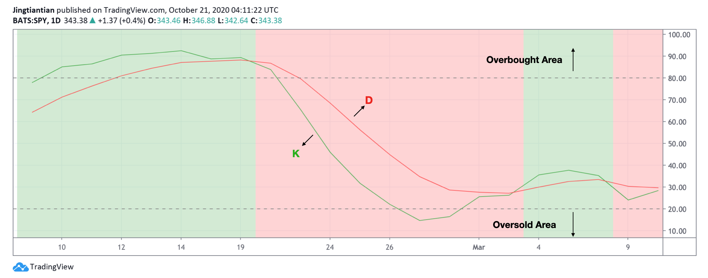
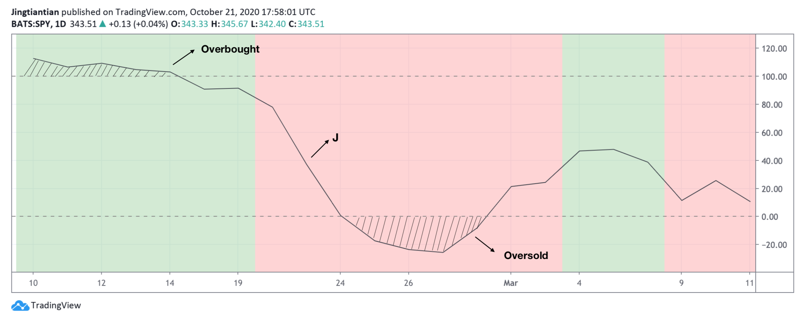
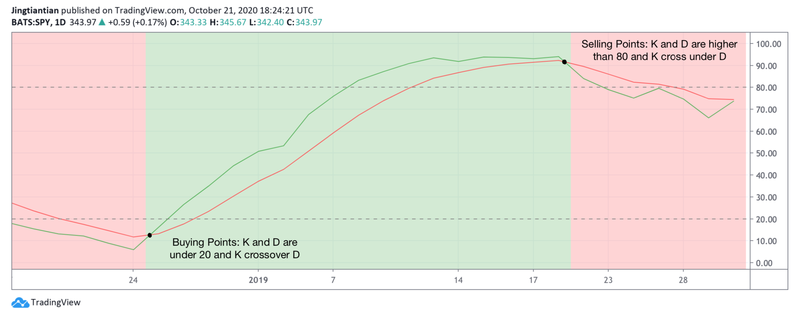
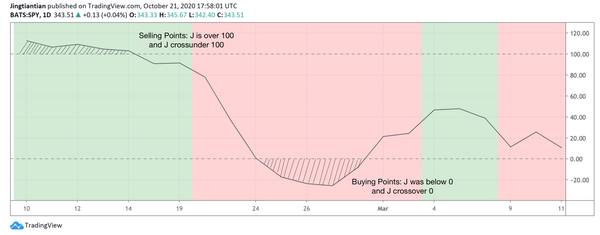

## 1. What is the KDJ Stochastic Oscillator?

KDJ Stochastic Oscillator is a technical analysis tool developed by George Lane.
The KDJ is a momentum indicator, first developed in the 1950s. The original Stochastic Oscillator just has two lines, K and D. Today, KDJ we introduce is slightly different from the first version. There are three lines that compose KDJ Stochastic Oscillator: K, D and J. The J-line, in turn, represents the divergence of the D value from the K. The convergence of these lines will hint at emerging trading opportunities.

Before calculating KDJ, we need to calculate RSV(Raw Stochastic Value) first.

RSV equals close price minus lowest price in the past 9 period over highest price in the past period minus lowest price in the past 9 period

RSV = (Close price - Lowest price in the past 9 period)/(Highest price in 9 period - Lowest Price in 9 period)*100

K equals two-third of previous K value plus one-third rsv.

K = 2/3 * K[1] + 1/3 * RSV

D equals two-third of pervious D value plus one-third rsv.

D = 2/3 * D[1] + 1/3 * RSV

J equals 3 times K minus 2 times D.

J = 3 * K - 2 * D

## 2. What does the KDJ Stochastic Oscillator tell you? 

### · Momentum Concept

KD is the momentum indicator, K and D would be always between 0 and 100. J would be over the range of 0 to 100.

Here, we take an example. If the highest price in the past 9 bars is $50, close price is $36, and the lowest price in the past 9 bars is $20, rsv would be 53.33

Then, based on the rsv value, we can calculate K and D value

### · Overbought and Oversold

When the K and D value are both below 20, the stock price might be oversold. During the oversold area, if the K crossover D, it’s called gold cross, which means that the stock price is oversold and the stock price starts to rebound.

When the K and D value are both over 80, the stock price might be overbought. During the overbought area, if the K crossunder D, it’s called death cross, which means that the stock price is overbought and the stock price starts to turn down.

When the J is below 0, the stock price also might be oversold. During the oversold area, if the J crossover 0, it’s also means the golden-cross

When the K is over 100, the stock price might be overbought. During the overbought area, if the J crossunder 100, it’s also means the death-cross.

## 3. KDJ Stochastic Oscillator Strategy

### · KD Crossover and Crossunder

We can use the crosses to identify the best time to enter or exit the market. When we observe a gold cross when K and D are in oversold area, we buy the stock as the price will rebound soon. On the other hand, when we see a death cross in overbought area, we sell the stock as the price has reached it peak and will drop soon

### · J Crossover and Crossunder

We can also use J line to tell the oversold and overbought areas.
When J line is below 0, the stock is oversold; when the line is above 100, the stock is overbought.
When J crosses over 0 from below, we buy stock as the price will begin to rise soon; when J crosses 100 from above, we sell stock as the price will start to decrease.

## 4. Tradingview Pine Script

### · Step One: Initial Setting

(1) Step one initial setting is the step we set up the strategy property, which includes “Strategy ID”, “The plot overlays the main chart or show on the separate chart pane. ”, “How much is the initial capital”, “How many percentages of capital buying the equity?”, “How much is commission fee”

(2) First, we need to set up the Pine Script version. Here, we are using the lastest version, version four.

(3) Then, we start to code the strategy property. The double quote we type “Yaonology KDJ Indicators Tutorial”, which is the strategy id.

(4) “overlay equals false” means that the plot will show on the separate chart pane.

(5) Then, we set up the initial capital, here, we code “initial_capital equals 10000” and “currency = currency.USD”, which means that we are using US$10000 as the initial capital.

(6) Then, we need to determine how many shares we trade equities. Here, we code “default_qty_type equals strategy.percent_of_equity” and “default_qty_value equals a hundred”, which means that we are using the percentage type to trade the equity, and we use 100 percent of capital to trade the equities.

(7) Finally, we set up the commission fee. Here, we code “commision_type equals strategy.commission.percent” and “commission_value = 0”, which means that we use the percentage type to calculate the commission fee, and here we set up 0% commission fee because most brokers don’t charge the commission fee currently.

    //version = 4
    strategy("Yaonology KDJ Indicators Tutorial", overlay=false,
    default_qty_type = strategy.percent_of_equity, default_qty_value = 100,
    currency = currency.USD, initial_capital = 10000,
    commission_type = strategy.commission.percent, commission_value = 0)

### · Step Two: Parameter Setting

    //Step Two: Parameter Setting
    hgst = highest(high, 9)
    lwst = lowest(low, 9)
    rsv = (close - lwst)*100 / (hgst - lwst)
    
    k = 0.0
    d = 0.0
    k := (rsv + 2 * nz(k[1]))/3
    d := (k + 2 * nz(d[1]))/3
    j = 3*k - 2*d
    
(1) Step Two Parameter Setting is the step we set up the KDJ parameter. 

(2) The highest function returns the highest value of a given set of numbers. High means the highest price of the day, and 9 means the 9 bars period.

(3) ”hgst equals highest high and 9” means we give “hgst” the value of the stock’s highest price in the last 9 days.

(4) The lowest function, on the other hand, gives the lowest value of a set of numbers. Low means the lowest price of a day, and 9 means the 9 bars period.

(5)  ”lwst equals lowest low and 9” is similar to the previous line. We give “lwst” the lowest price in the last 9 days.

(6) “rsv equals the difference between close and lwst times 100 divided by difference between hgst and lwst” is how we calculate  the rsv value of the day by using pine script. As previously discussed, the rsv value equals close price minus lowest price in the past 9 period over highest price in the past period minus lowest price in the past 9 period.

(7) Next, we set up the values of K line, D line and J line.

(8) First, we initialize two variables, k and j, and let them equal to 0. By doing that, we are telling pine script that k and j will be numbers, if not letters or other things.

(9) “k colon equals rsv plus 2 times nz  brackets k square brackets 1 divided by 3” is how we calculate the k line’s value.  Remember, K equals two-third of previous K value plus one-third rsv.

(10) We use several pine script expressions and functions here to calculate the K values. First, pay attention to the colon equals sign after k. It means we are updating the value of the variable with the one being calculated from the right hand side of the combination of the signs. In previous lines, we initialize the value of k to 0. This line will change its value to rsv plus 2 times nz  brackets k square brackets 1 divided by 3.

(11) Second, look at the nz function. The function changes all values that don’t exist to 0. It is very important, and we’ll come back to it later.

(12) Third, remember the expression of the square brackets after k with an 1 in it. In pine script, if you ever see a square bracket coming after a variable with a number in it, it means we are referring to a historical value within the variable. For example, k square brackets 1 means the k value of yesterday. If the number in the brackets is 2, it means the k value 2 days ago. By changing the number in the brackets, you can refer any historical value as long as it exists.

(13) Now let’s go back to the nz function we just mentioned. Why we need to replace any value that doesn’t exist here? Because it’s possible that we reach the beginning of history! On Tradingview the earliest stock information is in 1980s. When we want to calculate the k value of the first day with record, our attempt to get yesterday’s k value will fail, as there’s no “yesterday” any more. Thus, the script will stop running because we are referring to a number that doesn’t exist. By using the nz function,however, the invalid number becomes 0, which is a valid number. If you want to be a master of pine script, how to get desired historical values and deal with potential errors is a lesson you must take.

(14) Now let’s move to the next line of the script. “D colon equals k plus nz brackets d square brackets 1 divided by 3” updates the value of d line. 
It’s very similar to the line we just spend some time talking about.

(15) Finally, we calculate the j line value by using the difference between 3 times k and 2 times d.

### · Step Three: Plotting

    //Step Three: Plotting
    plot(k, color = color.green)
    plot(d, color = color.red)
    plot(j, color = color.black)

(1) Now let’s plot what we just calculated.

(2) We first plot the k line. Plot brackets k comma color equals color dot green means we will be plotting k line in green.

(3) Similarly, we plot d line in red and j line in black.

### · Step Four: Strategy Entry and Strategy Close

####      * KD Crossover and Crossunder

    //Step Four: Strategy Entry and Strategy Close
    if (k < 20 and d < 20 and k > d and k[1] < d[1])
        strategy.entry(id= "kd", long = true)
        
    if (k > 80 and d > 80 and k < d and k[1] > d[1])
        strategy.close(id= "kd")

(1) In the previous section, we discussed in theory how to pick buying and selling points with KDJ indicators. Here, we are replicating the strategy by pine script.

(2) We use the if statements to tell the system when to buy and when to sell. If k is smaller than 20 and d is smaller than 20 and k is larger than d and k square brackets 1 is smaller than d square brackets 1 are the conditions of buying the stock. Remember, we buy when observing a golden cross in oversold area, which is when both k line and d line are below 20. We are doing the same thing here by saying k smaller than 20 and d smaller than 20.

(3) Then, we define what a golden cross is. A golden cross is when k line crosses d line from below. That is, yesterday’s k value is smaller than yesterday’s d value, but today’s k value is larger than today’s d value. This is the part of k larger than d and k square brackets 1 smaller than d square brackets 1.

(4) When all these conditions are met, we tell the system to buy stock. Strategy dot entry brackets id equals quote kd comma long equals true is the expression we use to buy the stock. Id equals quote kd means whenever a transactions happens there will be a small label called kd beside it.

(5) Long equals true means we are buying the stock when the conditions above are met

(6) Remember, you must press tab before all lines to be executed by if statement.

(7) Next, we define when to sell the stock. We sell when observing a death cross in overbought area, where both k and d line are above 80. A death cross is when k line crosses d line from above, which means yesterday’s k value is larger than d value, and today’s k value is smaller than d value. 

(8) Strategy dot close brackets id equals quote id means we are telling the system to sell the stock when conditions mentioned above are met. Again, we add a label called kd to each selling transaction happens. Remember, the id under buying instruction and selling instruction must match, otherwise there’ll be an error.

(9) Also, we don’t need the long equals true part anymore, as we are selling, or shorting, not longing the stock any more.

|  | **Net Profit** | **Precent Profitable** | **Profit Factor** | **Max Drawdown** | 
| --- | --- | ---| --- | --- |
| **KD Crossover and Crossunder** | 15.96% | 72.73% | 1.369 | 26.98% |

This is the historical cumulative result we get by applying KD strategy only to SPY data.

####      * KD Crossover and Crossunder and J Crossover and Crossunder

    //Step Four: Strategy Entry and Strategy Close
    if (k < 20 and d < 20 and k > d and k[1] < d[1]) or (j > 0 and j[1] < 0)
        strategy.entry(id= "kd", long = true)
        
    if (k > 80 and d > 80 and k < d and k[1] > d[1]) or (j < 100 and j[1] > 100)
        strategy.close(id= "kd")

|  | **Net Profit** | **Precent Profitable** | **Profit Factor** | **Max Drawdown** | 
| --- | --- | ---| --- | --- |
| **KD Crossover and Crossunder** | 15.96% | 72.73% | 1.369 | 26.98% |
| **KD Crossover and Crossunder with J Crossover and Crossunder** | 171.38% | 69.12% | 1.621 | 34.14% |

(1) Now let’s combine our KD strategy and J strategy together

(2) we now define our buying condition as the following: if we see a golden cross in oversold area indicated by k and d line, or we see j line going from negative value to positive value, we buy the stock

(3) on the other hand, if we see a death cross in overbought area indicated by k and d line, or se wee j line goes negative from positive, we sell the stock

(4) by adding j strategy, we observe a significant increase in net profit. It shows you the magic of strategy combination!

####      * KD Against the Market

    //Step Four: Strategy Entry and Strategy Close
    if (k > 80 and d > 80)
        strategy.entry(id= "kd", long = true)
        
    if (k < 20 and d < 20)
        strategy.close(id= "kd")

|  | **Net Profit** | **Precent Profitable** | **Profit Factor** | **Max Drawdown** | 
| --- | --- | ---| --- | --- |
| **KD Crossover and Crossunder** | 15.96% | 72.73% | 1.369 | 26.98% |
| **KD Crossover and Crossunder with J Crossover and Crossunder** | 171.38% | 69.12% | 1.621 | 34.14% |
| **KD Against the Market** | 304.88% | 55.17% | 2.195 | 38.89% |

(1) We may use KD strategy against the market.

(2) In the past, we use k and d lines to forecast the coming reversion of price trends.

(3) Now, we use the two lines to catch the current trend. We buy stock when both k and d move beyond 80, which means the stock just enters overbought area, and the price is currently rising

(4) On the other hand, we sell the stock when both k and d goes below 20, which means the stock just enters oversold area and the price has just began to fall quickly.

(5) By trading in this way, we are simply following the trend by buying the stock as the price starts to rise, and sell it when price starts to fall

(6) Remember, KDJ indicators only indicate the strength of price trend, not market price itself. It is totally possible that after the stock goes from overbought to oversold area its market price is still higher comparing to the price before it goes into overbought area

(7) In fact, the KD strategy against the market ends up more profitable

####      * KD Against the Market with J crossover and crossunder

    //Step Four: Strategy Entry and Strategy Close
    if (k > 80 and d > 80)
        strategy.entry(id= "kd", long = true)
        
    if (k < 20 and d < 20)
        strategy.close(id= "kd")
        
    if (j > 0 and j[1] < 0)
        strategy.entry(id= "j", long = true)
        
    if (j < 100 and j[1] > 100)
        strategy.close(id= "j")

|  | **Net Profit** | **Precent Profitable** | **Profit Factor** | **Max Drawdown** | 
| --- | --- | ---| --- | --- |
| **KD Crossover and Crossunder** | 15.96% | 72.73% | 1.369 | 26.98% |
| **KD Crossover and Crossunder with J Crossover and Crossunder** | 171.38% | 69.12% | 1.621 | 34.14% |
| **KD Against the Market** | 304.88% | 55.17% | 2.195 | 38.89% |
| **KD Against the Market with J Crossover and Crossunder** | 425.83% | 64.38% | 2.132 | 51.63% |

We apply the same logic and combine j indicator. Again, the profit is even higher with three indicators combined and against the market

####      * KD Against the Market in the Long-term Bull Trend (200-SMA) with J crossover and crossunder

    //Step Four: Strategy Entry and Strategy Close
    if (k > 80 and d > 80) and sma(close, 200) > sma(close, 200)[1]
        strategy.entry(id= "kd", long = true)
        
    if (k < 20 and d < 20)
        strategy.close(id= "kd")
        
    if (j > 0 and j[1] < 0)
        strategy.entry(id= "j", long = true)
        
    if (j < 100 and j[1] > 100)
        strategy.close(id= "j")

|  | **Net Profit** | **Precent Profitable** | **Profit Factor** | **Max Drawdown** | 
| --- | --- | ---| --- | --- |
| **KD Crossover and Crossunder** | 15.96% | 72.73% | 1.369 | 26.98% |
| **KD Crossover and Crossunder with J Crossover and Crossunder** | 171.38% | 69.12% | 1.621 | 34.14% |
| **KD Against the Market** | 304.88% | 55.17% | 2.195 | 38.89% |
| **KD Against the Market with J Crossover and Crossunder** | 425.83% | 64.38% | 2.132 | 51.63% |
| **KD Against the Market with Bull Trend J Crossover and Crossunder** | 491.19% | 66.27% | 2.164 | 35.02% |
